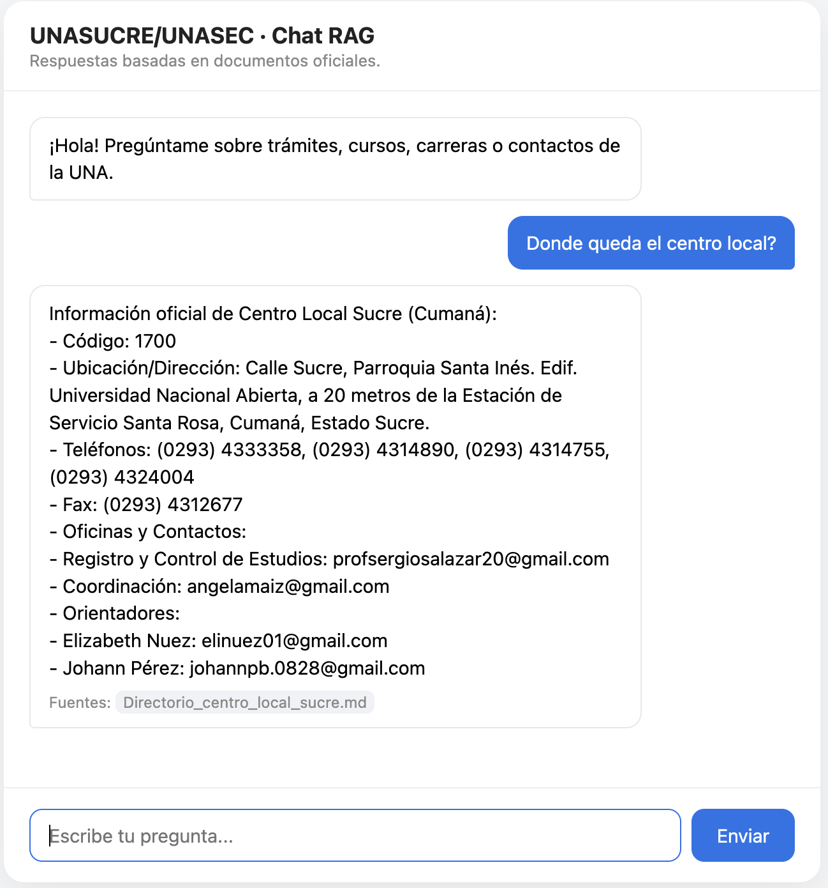
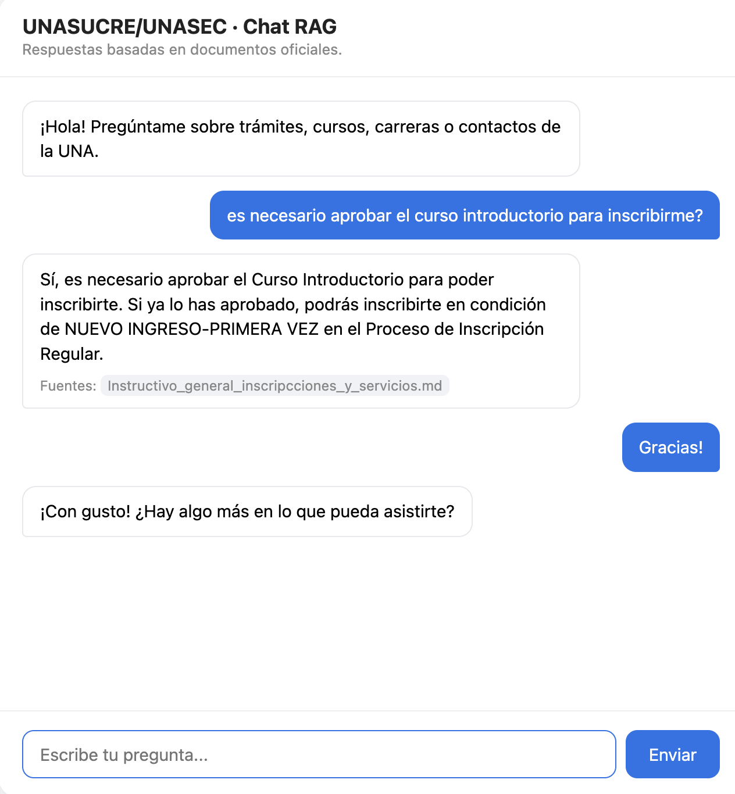

# UNASUCRE/UNASEC RAG Microservice (MVP)

Conversational assistant for the **Centro Local Sucre** of the
Universidad Nacional Abierta (UNA). Answers student questions about
registration processes, fees and banks, academic requirements, and
official contact points, grounded strictly on the university's own
Markdown knowledge base via Retrieval-Augmented Generation (RAG).

> Scope: this MVP serves **Sucre only**. Queries about any other UNA
> center are redirected to the official directory at www.unasec.com.

See [PRD.MD](./PRD.MD) for the full product brief.

## Tech Stack

- **Backend:** FastAPI (Python)
- **Embeddings:** nomic-embed-text (local via Ollama)
- **LLM:** Llama-3.2-3B (local via Ollama)
- **Vector DB:** ChromaDB (local)
- **Orchestration:** LangChain
- **Document parsing:** python-docx (.docx) + Markdown (.md) sources
- **Chunking:** MarkdownHeaderTextSplitter for section-aware chunks (Recursive fallback for docx)
- **Infrastructure:** Docker

## Architecture: Waterfall Router Pattern

The RAG microservice implements a **three-tier execution flow** that short-circuits processing for trivial or rule-based queries, ensuring sub-5ms responses for common interactions while retaining full semantic power for complex questions.

```
User Query
    │
    ▼
┌──────────────────────┐   Matched?  ──► Return canned response (<1ms)
│ Tier 1: Heuristics   │              │  e.g. greetings, thanks, farewells
└──────────────────────┘              │
    │ No                            │
    ▼                              │
┌──────────────────────┐  Resolved? ──► Return formatted rule data (50-150ms)
│ Tier 2: Deterministic│             │  e.g. bank accounts, coordinator emails
└──────────────────────┘             │
    │ No                           │
    ▼                             │
┌──────────────────────┐           │
│ Tier 3: Semantic RAG │◄── Always run vector search + LLM generation (~500-1500ms)
└──────────────────────┘
    │
    ▼
Answer returned with sources & confidence
```

### Latency Expectations

| Tier | Description | Typical Latency | Implementation |
|------|-------------|-----------------|----------------|
| Heuristics | Greetings, thanks, farewells | <1ms | `app/services/rules.py` (`match_heuristic()`) |
| Deterministic | Sucre directory info, banks/contact datablocks | 50-150ms | `app/services/rules.py` (`evaluate_deterministic_rules()`) |
| Semantic RAG | Vector retrieval + Llama 3.2 | ~500-1500ms | `app/services/rag_engine.py` (`RagEngine.answer()`) |

### Implementation Notes

- **Heuristics** (`match_heuristic`): Uses anchored regex patterns to detect conversational phrases. Bypasses vector DB entirely.
- **Deterministic** (`evaluate_deterministic_rules`): regex-triggered rules (bank, directory, other-center redirect) that retrieve only the exact source file from ChromaDB (no LLM). The `match_other_centro` rule redirects non-Sucre queries to www.unasec.com before any retrieval.
- **Semantic RAG**: Full retrieval-augmented generation pipeline. Includes query reformulation for follow-up questions (skipped for heuristic matches or empty history).

All tiers update session history consistently for multi-turn conversations.

## Folder Structure

```
.
├── app/
│   ├── core/             # Configuration (pydantic-settings)
│   ├── schemas/          # Pydantic request/response models
│   ├── services/         # RAG pipeline (loader, splitter, embeddings, store, llm, ollama_health, rules, rag_engine)
│   ├── static/           # Chat widget (HTML)
│   ├── images/           # Screenshots used in this README
│   └── utils/            # Logging, unanswered-query log
├── data/
│   ├── raw_docx/         # Optional .docx instructions
│   ├── md_docs/          # Markdown knowledge base (master guide + Sucre directory)
│   ├── chroma_db/        # Persistent ChromaDB storage
│   └── unanswered_queries.jsonl   # Logged no-context queries
├── scripts/              # Ingestion script
├── tests/                # Unit tests (pytest)
├── Dockerfile
├── docker-compose.yml
└── requirements.txt
```

## Setup

Requirements: Python 3.12+ and [Ollama](https://ollama.com/) running locally.

1. Create and activate a virtual environment, then install dependencies:
   ```bash
   python -m venv .venv && source .venv/bin/activate
   pip install -r requirements.txt
   ```
2. Configuration is optional — sane defaults are built into `app/core/config.py`.
   To override, create `.env` (see the table below) and it is loaded automatically.
3. Verify Ollama and models (the app and the ingestion script refuse to start otherwise):
   ```bash
   ollama serve          # in a separate terminal
   ollama pull nomic-embed-text
   ollama pull llama3.2:3b
   ```
4. Add official Markdown docs to `data/md_docs/` (and optional `.docx` to `data/raw_docx/`).
5. Ingest into ChromaDB: `python scripts/ingest.py --skip-docx`
6. Run the API: `uvicorn app.main:app --reload` — or `docker compose up --build`
   (Docker requires Ollama reachable on the host at `OLLAMA_BASE_URL`).

### Environment variables

| Variable | Default | Purpose |
|----------|---------|---------|
| `OLLAMA_BASE_URL` | `http://localhost:11434` | Ollama server endpoint |
| `OLLAMA_EMBED_MODEL` | `nomic-embed-text` | Embedding model (must be pulled) |
| `OLLAMA_LLM_MODEL` | `llama3.2:3b` | Chat model (must be pulled) |
| `CHROMA_DB_DIR` | `data/chroma_db` | ChromaDB persistence path |
| `CHROMA_COLLECTION_NAME` | `unasucre_documents` | Collection name |
| `CHUNK_SIZE` / `CHUNK_OVERLAP` | `1000` / `180` | Document chunking |
| `RETRIEVAL_TOP_K` | `4` | Docs retrieved per query |

## API

- `POST /api/v1/query` — body: `{"query": "¿Cuáles son los requisitos de inscripción?"}`
  - Omit `session_id` to start a new conversation (one is returned in the response).
  - Reuse the returned `session_id` to keep conversation context for follow-up questions.
- `GET /chat` — the web chat widget (served from `app/static/chat.html`); it posts to `/api/v1/query` in the browser.
- `GET /health`

Conversation history is stored in memory (resets on restart).

## Examples

Screenshots of the chat widget making queries against the `/api/v1/query` endpoint:




